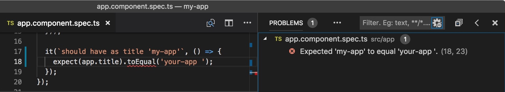

# VS Code Karma Problem Matcher

[](LICENSE) [](https://travis-ci.org/rctay/vscode-karma-problem-matcher) 

## Description

Capture errors from Karma tests running in Visual Studio Code.



## Usage

After installing this extension, in the `"problemMatcher"` field in `tasks.json`, specify `"$karma-jasmine2"` and `"isBackground": true`.

Jasmine 2 is installed by default by Angular; if you have upgraded to Jasmine 3, specify `"$karma-jasmine3"` instead.

For example:

```
{
    // See https://go.microsoft.com/fwlink/?LinkId=733558
    // for the documentation about the tasks.json format
    "version": "2.0.0",
    "tasks": [
        {
            "label": "Start Live Unit Tests",
            "type": "npm",
            "script": "test",
            "group": "test",
            "isBackground": true,
            "problemMatcher": "$karma-jasmine2"
        }
    ]
}
```

Thanks:
- Karma logo by [Isaac Durazo](https://dribbble.com/isaacdurazo).

**Enjoy!**
